# Ryzon AI Platform — Project Overview

> Alle Unternehmensdaten an einem Ort — als Fundament für AI-Agenten, LLM-Anwendungen und smarte Cloud-Services.

---

## Die Vision

Unternehmenswissen ist heute über Dutzende Tools verstreut: Meeting-Notizen in Google Drive, Aufgaben in Asana, Kreativ-Assets in Figma, Kundendaten im ERP, E-Mails in Gmail. Jedes Tool hat seine eigene Suche, sein eigenes Format, seinen eigenen Zugang.

**Die zentrale Datenbank ändert das.** Sie sammelt Informationen aus allen Quellen, reichert sie mit AI an und stellt sie einheitlich bereit — für AI-Agenten, für LLM-Anwendungen via MCP, und für Web-Services in der Cloud.

```
Team-Mitglied:  "Was wurde in den letzten Meetings zum Thema ERP beschlossen?"

AI-Agent:       Ich habe 4 relevante Meetings gefunden:
                - 18.03. ERP-Auswahl: Shortlist auf Odoo und NetSuite eingegrenzt
                - 25.03. Vendor-Demo: Odoo überzeugt bei Warenwirtschaft
                - 01.04. Entscheidung: Odoo wird Pilotprojekt ab Mai
                - 07.04. Kick-off: Simon koordiniert Implementierung
```

---

## Die Architektur — Zentrale Datenbank als Fundament

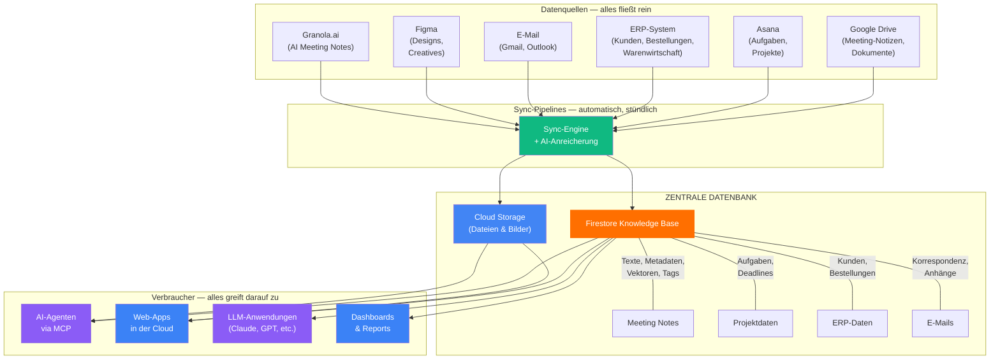

### Warum eine zentrale Datenbank?

| Ohne zentrale DB | Mit zentraler DB |
|-----------------|-----------------|
| Jedes Tool hat eigene Suche | **Eine Suche** findet alles |
| AI kann nur ein Tool gleichzeitig nutzen | AI hat **Zugriff auf alles** in einem Schritt |
| Web-Apps brauchen je eine eigene Integration | Web-Apps nutzen **eine einzige Quelle** |
| Wissen geht verloren | Alles wird **dauerhaft gespeichert und angereichert** |
| Kontextwechsel für jede Frage | **Ein Ort** für alle Fragen |

---

## Wie Daten in die zentrale Datenbank kommen

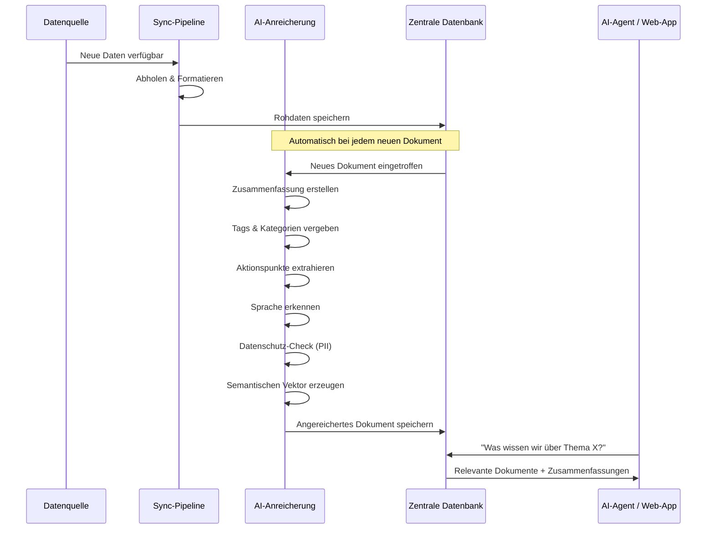

### Was die AI aus jedem Dokument extrahiert

| Feld | Beispiel |
|------|---------|
| **Zusammenfassung** | "Team hat Q2-Roadmap besprochen, Fokus auf Mobile-First" |
| **Tags** | `q2-roadmap`, `mobile`, `produkt-strategie` |
| **Aktionspunkte** | "Simon erstellt Mobile-Spec bis 14. April" |
| **Entscheidungen** | "Mobile-First für Q2", "Desktop-Redesign verschoben" |
| **Kategorie** | Planning, Standup, Review, Retro, 1:1, Demo, etc. |
| **Sprache** | Deutsch, Englisch, etc. |
| **Datenschutz** | Sicher oder Enthält personenbezogene Daten |
| **Semantischer Vektor** | Ermöglicht Suche nach Bedeutung, nicht nur nach Stichworten |

---

## Wer nutzt die zentrale Datenbank?

```mermaid
graph TB
    subgraph "Zentrale Datenbank"
        DB["Firestore\nKnowledge Base"]
    end

    subgraph "AI-Agenten via MCP"
        A1["Meta Ads Agent\nErstellt Kampagnen mit\nWissen über Produkte & Assets"]
        A2["Google Ads Agent\nOptimiert Anzeigen basierend\nauf Meeting-Entscheidungen"]
        A3["Recherche-Agent\nBeantwortet Fragen aus\nallen Quellen gleichzeitig"]
        A4["Reporting-Agent\nErstellt Berichte aus\nERP + Meetings + Tasks"]
    end

    subgraph "Web-Anwendungen"
        W1["Internes Dashboard\nTeam-Wissen auf\neinen Blick"]
        W2["Kunden-Portal\nRelevante Infos\nautomatisch bereitgestellt"]
        W3["Automatisierungen\nWorkflows basierend\nauf Datenänderungen"]
    end

    subgraph "LLM-Anwendungen"
        L1["Chat-Interface\nMitarbeiter fragen\ndirekt die Wissensbasis"]
        L2["Zusammenfassungen\nAutomatische Briefings\nfür Führungskräfte"]
        L3["Übersetzungen\nMeeting-Notizen in\nandere Sprachen"]
    end

    DB --> A1
    DB --> A2
    DB --> A3
    DB --> A4
    DB --> W1
    DB --> W2
    DB --> W3
    DB --> L1
    DB --> L2
    DB --> L3

    style DB fill:#FF6F00,color:#fff,stroke:#FF6F00,stroke-width:3px
    style A1 fill:#8B5CF6,color:#fff
    style A2 fill:#8B5CF6,color:#fff
    style A3 fill:#8B5CF6,color:#fff
    style A4 fill:#8B5CF6,color:#fff
    style W1 fill:#3B82F6,color:#fff
    style W2 fill:#3B82F6,color:#fff
    style W3 fill:#3B82F6,color:#fff
    style L1 fill:#7C3AED,color:#fff
    style L2 fill:#7C3AED,color:#fff
    style L3 fill:#7C3AED,color:#fff
```

**Der entscheidende Punkt:** Die zentrale Datenbank ist kein Tool für sich — sie ist das **Fundament**, auf dem beliebig viele AI- und Web-Anwendungen aufgebaut werden können. Jede neue Quelle, die angebunden wird, macht _alle_ Anwendungen gleichzeitig schlauer.

---

## Zwei Arten der Suche

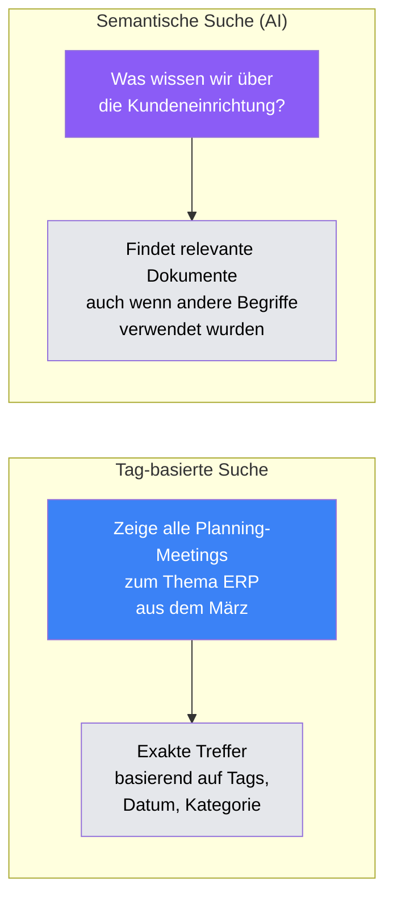

**Tag-basiert:** Schnell und präzise — "Alle Meetings mit Tag `erp-auswahl` vom März"

**Semantisch:** AI-gestützt — "Was wurde zum Thema Kundenbetreuung besprochen?" findet auch Notizen, die von "Kundensupport", "After-Sales" oder "Nachbetreuung" sprechen.

---

## Die drei MCP-Server — Brücken zwischen AI und Tools

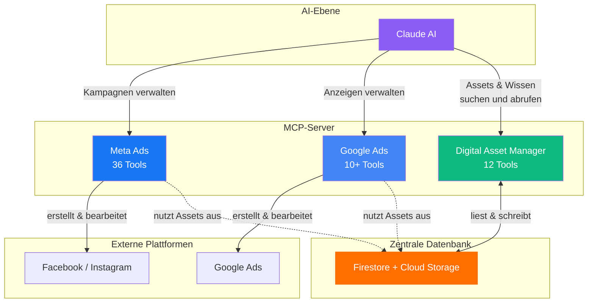

### Meta Ads Server — 36 Tools

> Alles für Facebook- und Instagram-Werbung: Kampagnen erstellen, Zielgruppen definieren, Performance analysieren.

- Kampagnen erstellen, bearbeiten, pausieren, duplizieren
- Alle Kreativformate: Einzelbild, Karussell, Video, Dynamic Ads
- Zielgruppen: Interessen, Verhalten, Demografie, Lookalikes
- Performance: Ausgaben, Impressions, Klicks, Conversions, ROAS

### Google Ads Server — 10+ Tools

> Google Search und Display Advertising per Sprache steuern.

- Kampagnen- und Anzeigengruppen-Management
- Keyword- und Zielgruppen-Targeting
- Performance-Reporting

### Digital Asset Manager — 12 Tools

> Kreativ-Assets und Unternehmenswissen verwalten und durchsuchen.

**Asset-Tools:**
| Tool | Was es macht |
|------|-------------|
| `list_assets` | Assets nach Kampagne durchsuchen |
| `search_assets` | Nach Name, Tags, Format oder Maßen suchen |
| `get_asset_download_url` | Sicheren Download-Link generieren |
| `upload_asset` | Neue Datei hochladen |
| `tag_asset` | Tags und Metadaten aktualisieren |
| `export_figma_frames` | Figma-Designs direkt ins DAM exportieren |

**Wissens-Tools:**
| Tool | Was es macht |
|------|-------------|
| `query_knowledge_base` | Nach Tags, Datum, Serie oder Typ suchen |
| `get_document` | Vollständiges Dokument abrufen |
| `search_knowledge_base_semantic` | Natürlichsprachliche Suche (AI-gestützt) |

---

## Datenschutz & Sicherheit

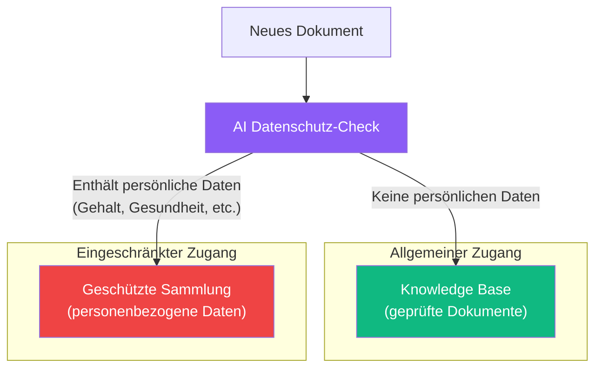

- AI prüft **jedes Dokument** automatisch auf personenbezogene Daten
- Sensible Dokumente werden in eine **geschützte Sammlung** verschoben
- Geschäftliche E-Mails und Namen im beruflichen Kontext werden **nicht** markiert
- Verschiedene **Zugriffsebenen** pro Sammlung möglich
- Alle Daten bleiben in der **EU** (Region europe-west3, Frankfurt)

---

## So funktioniert das Onboarding

### Für Team-Mitglieder (Meeting-Notizen)

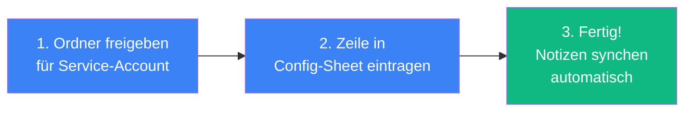

### Für Designer

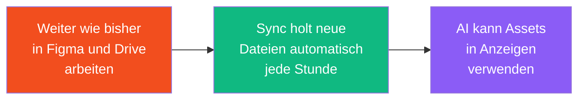

**Kein Workflow ändert sich.** Die Plattform arbeitet im Hintergrund.

---

## Infrastruktur

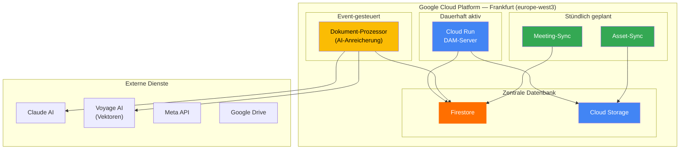

**Kosten:** Minimal. Cloud Functions zahlen nur bei Nutzung. Firestore und Cloud Storage kosten Cent pro Monat. AI-Verarbeitung kostet ca. 0,001 EUR pro Dokument.

---

## Roadmap

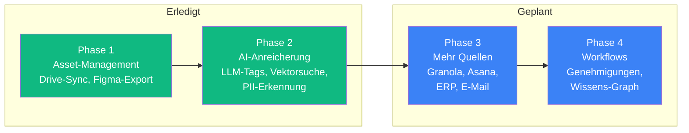

| Phase | Status | Was kommt dazu |
|-------|--------|---------------|
| **Phase 1** — Asset-Management | Fertig | Drive-Sync, Asset-Suche, Figma-Export |
| **Phase 2** — AI-Anreicherung | Fertig | LLM-Tagging, Zusammenfassungen, Vektorsuche, PII-Erkennung |
| **Phase 3** — Weitere Quellen | Geplant | Granola.ai, Asana, ERP-Daten, E-Mails |
| **Phase 4** — Workflows & Graph | Geplant | Genehmigungen, Versionierung, Wissens-Graph über alle Quellen |

---

## Zusammenfassung

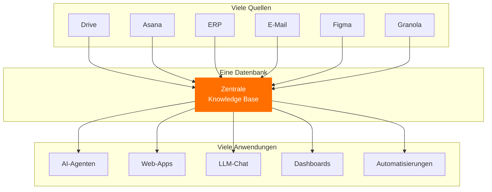

**Viele Quellen rein. Eine Datenbank. Viele Anwendungen raus.**

Das ist das Fundament. Jede neue Quelle macht alle Anwendungen schlauer. Jede neue Anwendung hat sofort Zugriff auf alles.

---

*Gebaut vom Ryzon-Team. Angetrieben von Claude, Meta APIs, Google APIs, Figma und einer Menge Automatisierung.*
