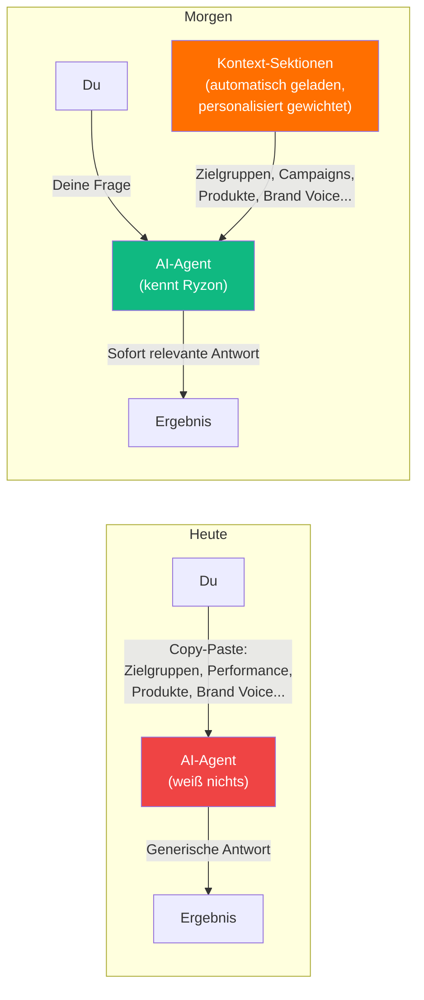

# Jeder Agent startet bei Null

> Warum AI-Assistenten heute nur einen Bruchteil ihres Potentials ausschöpfen — und was sich ändert, wenn sie euer Unternehmen kennen.

---

## Heute: Kontext manuell, jedes Mal neu

Stellt euch folgendes Szenario vor:

> **Du:** Erstelle eine neue Conversion-Kampagne für die Triathlon-Linie im DACH-Markt.
>
> **AI-Agent:** Gerne! Welche Zielgruppe möchtest du ansprechen? Welches Budget hast du? Welche Creatives sollen verwendet werden? Welche Bidding-Strategie? Welche Naming-Convention nutzt ihr? Welche Produkte sind in der Triathlon-Linie? Welche Märkte genau — nur DE oder auch AT/CH?

Klingt bekannt? Der Agent weiß nichts über Ryzon. Jedes Gespräch beginnt bei Null.

Was macht ihr dann? Ihr kopiert Kontext rein:

- Zielgruppen-Dokument aus dem letzten Meeting
- Letzte Performance-Zahlen aus dem Ads Manager
- Produktlisten und Launches
- Brand Guidelines und Tonalität
- Marktspezifische Besonderheiten

**Das ist die Kontext-Steuer** — die Zeit, die ihr jeden Tag damit verbringt, dem AI-Agenten beizubringen, was euer Unternehmen ist.

---

## Morgen: Kontext automatisch, personalisiert

Das gleiche Szenario, aber der Agent kennt Ryzon:

> **Du:** Erstelle eine neue Conversion-Kampagne für die Triathlon-Linie im DACH-Markt.
>
> **AI-Agent:** Basierend auf euren aktuellen Daten schlage ich folgendes vor:
>
> - **Zielgruppe:** Eure Triathlon-Persona (28–45, Ausdauersportler, hohes HH-Einkommen) hat in DACH einen 3.2x ROAS bei Catalog-Kampagnen
> - **Creative:** Video-Ads performen 40% besser als Einzelbilder im Triathlon-Segment
> - **Produkte:** Die neue Tri Suit Kollektion launcht am 15. Mai — soll ich die mit einbeziehen?
> - **Markt:** Für CH sollten wir separate Ad Sets mit französischem Copy anlegen
>
> Soll ich die Kampagne so aufsetzen?

Kein Copy-Paste. Kein Re-Teaching. Der Agent weiß, was er wissen muss — und priorisiert, was für **deine Rolle** am relevantesten ist.

---

## Was sich ändert

---

## Die drei Veränderungen

| | Heute | Morgen |
|---|---|---|
| **Kontext** | Manuell kopiert, jedes Mal | Automatisch geladen, immer aktuell |
| **Relevanz** | Einer gibt dem Agent alles | Agent priorisiert nach deiner Rolle |
| **Aktualität** | Kontext ist so aktuell wie dein letztes Copy-Paste | Sektionen aktualisieren sich automatisch aus Live-Daten |

---

## Diskussion

**Frage an euch:** Welchen Kontext gebt ihr eurem AI-Assistenten am häufigsten mit? Was sind die Informationen, die ihr immer wieder neu erklären müsst?
