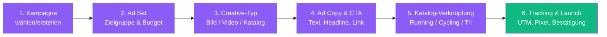
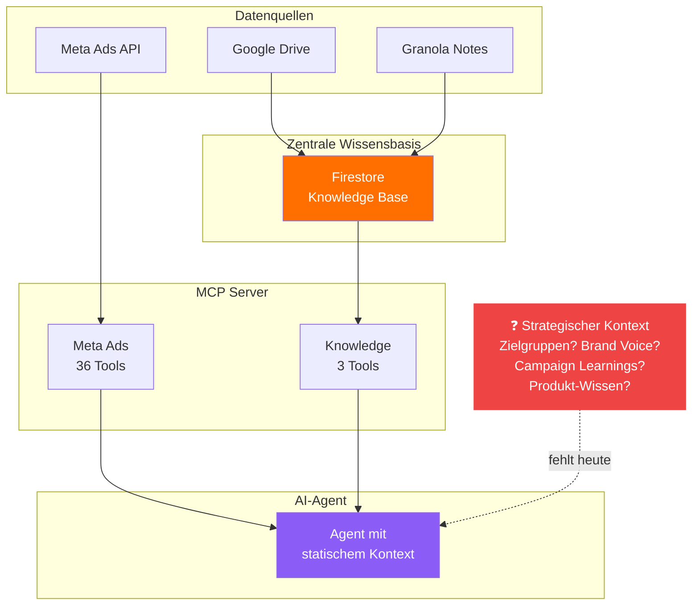

# Das Fundament steht bereits

> Wir bauen nicht bei Null an — die zentrale Wissensbasis, AI-Anreicherung und Zugangskontrolle sind bereits live.

---

## Was heute schon funktioniert

| Fähigkeit | Status | Was das für euch bedeutet |
|-----------|--------|--------------------------|
| **Meeting Notes Sync** (Google Drive, Granola) | Live | Entscheidungen aus euren Meetings sind durchsuchbar |
| **AI-Anreicherung** (Zusammenfassungen, Tags, Aktionspunkte) | Live | Jede Notiz wird automatisch strukturiert und verschlagwortet |
| **Semantische Suche** (Voyage AI Embeddings) | Live | Fragen in natürlicher Sprache, relevante Dokumente finden |
| **Zugangskontrolle** (rollenbasierte Policies) | Live | Ihr seht nur, was ihr sehen sollt — automatisch |
| **Meta Ads MCP** (36 Tools) | Live | Kampagnen erstellen und verwalten per Sprache |
| **Knowledge MCP** (Suche, Abruf, Semantik) | Live | AI kann während jeder Konversation auf die Wissensbasis zugreifen |

> Für eine detaillierte Übersicht der gesamten Plattform: siehe [Ryzon AI Platform — Project Overview](../PROJECT_SHOWCASE.md)

---

## Was die Agents heute schon können

Ein konkretes Beispiel: Der **Ryzon Ad Creation Flow** führt euch in 6 Schritten durch die komplette Anzeigenerstellung — von der Kampagnen-Auswahl bis zum fertigen Ad.

Dabei weiß der Agent bereits:
- Ryzon Account-ID, Page, Instagram Actor
- DSA-Pflichtangaben (Ryzon GmbH)
- Naming Conventions
- Pixel- und Tracking-Konfiguration
- UTM-Parameter mit Klar-Integration
- Alle Advantage+ Einstellungen

**Das ist statischer Kontext** — technische Konfiguration, die sich selten ändert.

---

## Die Lücke

Der Agent kennt heute die **technische Konfiguration** — Account-IDs, Pixel-Setup, Naming Conventions.

Was er **nicht kennt:**
- Wer eure Kunden sind (Zielgruppen, Personas)
- Was gerade performed (Campaign Learnings, ROAS-Trends)
- Wofür die Marke steht (Brand Voice, Messaging)
- Was als Nächstes kommt (Produktlaunches, Events, saisonale Planung)
- Was in welchem Markt anders läuft (DE vs. AT vs. CH vs. US)

**Dieses strategische Wissen lebt heute in euren Köpfen und in verstreuten Dokumenten.** Kontext-Sektionen schließen diese Lücke.

---

## Überleitung

Die Infrastruktur ist da. Die Wissensbasis sammelt und reichert Daten an. Was fehlt, ist eine Schicht, die dieses Wissen **kuratiert, strukturiert und personalisiert** an den Agent liefert.

Das sind **Kontext-Sektionen** — das nächste Kapitel.
