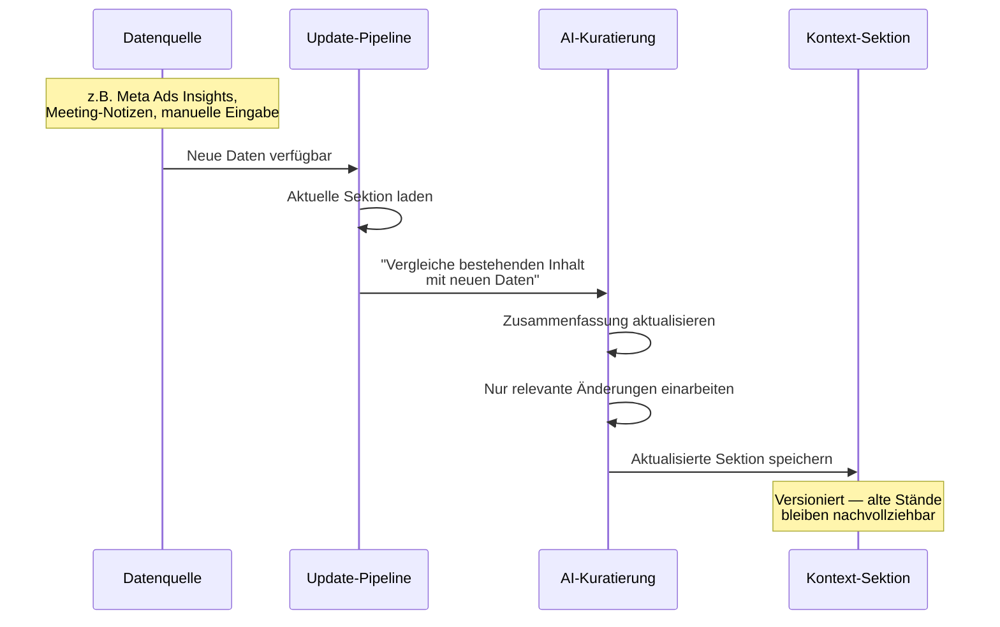

# Kontext-Sektionen — Modulare Wissensbausteine

> Kuratiertes, aktuelles Unternehmenswissen in unabhängigen Bausteinen — nicht rohe Dokumente, sondern AI-aufbereitete Briefings.

---

## Was ist eine Kontext-Sektion?

Eine Kontext-Sektion ist ein **kuratierter Wissensblock** zu einem bestimmten Thema. Kein Datendump aus 50 Seiten Meeting-Notizen, sondern ein strukturiertes Briefing, das die AI aus diesen 50 Seiten destilliert hat.

Stellt euch jede Sektion wie ein lebendiges Briefing-Dokument vor:
- Es wird **automatisch aktualisiert**, wenn neue Daten verfügbar sind
- Es fasst das **Wesentliche zusammen** — nicht alles, sondern das Relevante
- Es ist **unabhängig** von anderen Sektionen und kann einzeln gepflegt werden

---

## Anatomie einer Sektion

| Eigenschaft | Beschreibung | Beispiel |
|-------------|-------------|---------|
| **Name** | Eindeutiger Bezeichner | "Ryzon Zielgruppen" |
| **Inhalt** | AI-kuratierte Zusammenfassung (Markdown) | "Primäre Zielgruppe DACH: 28-45, Ausdauersportler..." |
| **Quelle** | Woher die Daten kommen | Wissensbasis-Meetings + manuelle Pflege |
| **Aktualisierung** | Wie oft der Inhalt erneuert wird | Wöchentlich |
| **Format** | Wie der Inhalt gespeichert ist | Markdown-Text in Firestore |

---

## Kandidaten für erste Sektionen

Hier sind Sektionen, die für Marketing besonders relevant sind. **Diese Liste ist ein Startpunkt — euer Feedback formt die endgültige Auswahl.**

### 1. Ryzon Zielgruppen
Demografien, Psychografien, Personas pro Segment und Markt. Welche Zielgruppen performen wo am besten.

| | |
|---|---|
| **Quelle** | Wissensbasis (Meetings mit Tag "Zielgruppe") + manuelle Pflege |
| **Aktualisierung** | Monatlich (Zielgruppen ändern sich selten) |
| **Beispiel-Inhalt** | "Triathlon-Persona: 28–45 Jahre, Ausdauersportler, HH-Einkommen >60k, technik-affin. DACH-Fokus mit wachsendem US-Segment..." |

### 2. Campaign Performance Snapshot
Aktuelle ROAS-Werte nach Kampagnentyp und Markt, Top/Bottom Performer, Spend-Trends, Benchmarks.

| | |
|---|---|
| **Quelle** | Meta Ads Insights (automatischer Pull) + Google Ads Daten |
| **Aktualisierung** | Wöchentlich |
| **Beispiel-Inhalt** | "DACH Triathlon: 3.2x ROAS (Catalog), 2.1x (Single Image). Top Performer: Video 'Tri Suit Launch' mit 4.8x ROAS. Spend-Trend: +15% MoM..." |

### 3. Produktlinien & Launches
Aktueller Produktkatalog (Running, Cycling, Triathlon, Signature), kommende Launches, Key Selling Points pro Linie.

| | |
|---|---|
| **Quelle** | Wissensbasis + manuelle Pflege |
| **Aktualisierung** | Bei Änderungen (Launch-Kalender) |
| **Beispiel-Inhalt** | "Tri Suit 2026: Launch 15. Mai. USPs: recyceltes Material, 12% leichter als Vorgänger, Preis 249 EUR. Running: Signature Drop 'Midnight' am 1. Juni..." |

### 4. Brand Voice & Messaging
Tonalität, Kernbotschaften, Do's und Don'ts für Ad Copy, freigegebene Claims, Sprach-Guidelines pro Markt.

| | |
|---|---|
| **Quelle** | Manuelle Pflege (Brand Team) |
| **Aktualisierung** | Quartalsweise |
| **Beispiel-Inhalt** | "Tonalität: premium, clean, performance-orientiert. Keine Superlative ('bester', 'einziger'). Immer: Materialinnovation betonen. DE: 'Sie'-Ansprache in Ads, 'Du' auf Social..." |

### 5. Creative Learnings
Welche Ad-Formate, Visuals und Hooks am besten performen. Catalog vs. Single Image vs. Video. Learnings aus Creative Reviews.

| | |
|---|---|
| **Quelle** | Meta Ads Insights + Meeting-Notizen (Creative Reviews) |
| **Aktualisierung** | Wöchentlich |
| **Beispiel-Inhalt** | "Video outperformt Single Image um 40% im Triathlon-Segment. Carousel funktioniert für Cross-Selling (Running → Accessories). UGC-Content hat 2x CTR vs. Studio-Shots..." |

### 6. Wettbewerbslandschaft
Zentrale Wettbewerber, Positionierungsunterschiede, Marktdynamik, aktuelle Aktionen der Konkurrenz.

| | |
|---|---|
| **Quelle** | Manuelle Pflege + Meta Ad Library Recherchen |
| **Aktualisierung** | Monatlich |
| **Beispiel-Inhalt** | "Hauptwettbewerber DACH: Castelli (Preis-Premium), MAAP (Lifestyle-Fokus), Rapha (Community). Ryzon-Differenzierung: Nachhaltigkeit + Performance. Castelli aktuell mit 20%-Rabattaktion..." |

### 7. Events & Kalender
Kommende Messen, Produktlaunches, saisonale Kampagnen (BFCM, Summer Sale), Sponsoring-Events.

| | |
|---|---|
| **Quelle** | Wissensbasis (Meetings) + manuelle Pflege |
| **Aktualisierung** | Wöchentlich |
| **Beispiel-Inhalt** | "Mai: Tri Suit Launch (15.5.), IRONMAN Hamburg Sponsoring (25.5.). Juni: Signature Drop 'Midnight' (1.6.), Tour de France Start (28.6.). Juli: Summer Sale ab 15.7..." |

### 8. Marktspezifische Besonderheiten
Pro-Markt-Nuancen: DE-Regulierungen, CH-Sprachanforderungen, US-Versandthemen, AT-Steuerfragen.

| | |
|---|---|
| **Quelle** | Wissensbasis + manuelle Pflege |
| **Aktualisierung** | Bei Bedarf |
| **Beispiel-Inhalt** | "CH: Drei Sprachregionen (DE/FR/IT), separate Ad Sets empfohlen. US: Free Shipping ab $150, Zoll-Hinweise in Copy. DE: Preisangabenverordnung beachten bei Sale-Ads..." |

---

## Wie Sektionen aktuell bleiben

**Der entscheidende Punkt:** Sektionen sind keine statischen Dokumente. Sie sind lebendige Zusammenfassungen, die sich automatisch anpassen — aber immer kuratiert und strukturiert bleiben.

---

## Diskussion

**Fragen an euch:**
- Welche dieser Sektionen wären für eure tägliche Arbeit am wertvollsten?
- Welche Sektionen fehlen in der Liste?
- Gibt es Informationen, die ihr heute mühsam zusammensuchen müsst und die als Sektion automatisiert werden könnten?
