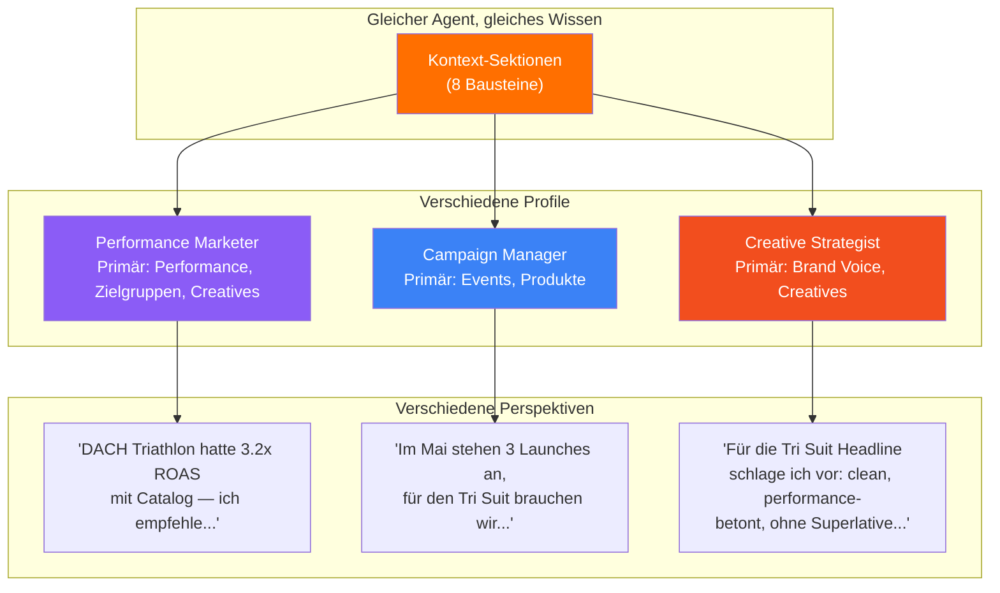

# Kontext-Profile — Deine persönliche Linse

> Gleicher Agent, gleiches Wissen — aber jede Rolle sieht die Welt anders. Profile steuern, was der Agent priorisiert.

---

## Was ist ein Kontext-Profil?

Ein Profil legt fest, **welche Sektionen** der Agent lädt und **wie prominent** er sie gewichtet. Die Agent-Anweisungen sind für alle gleich — nur die Gewichtung der Sektionen unterscheidet sich.

Das bedeutet: Ein Performance Marketer und ein Creative Strategist bekommen den **gleichen intelligenten Assistenten** — aber der Assistent denkt in den Kategorien, die für die jeweilige Rolle am wichtigsten sind.

---

## Wie Gewichtung funktioniert

LLMs gewichten Informationen automatisch danach, **wie sie präsentiert werden**. Wenn ihr einem Kollegen ein Briefing gebt und sagt "Das hier ist das Wichtigste", fokussiert sich das Gespräch darauf. Beim AI-Agenten funktioniert das genauso.

Wir nutzen drei Stufen:

| Stufe | Bedeutung | Wie der Agent damit umgeht |
|-------|-----------|---------------------------|
| **Primär** | Kernwissen für deine tägliche Arbeit | Agent bezieht sich proaktiv darauf, nutzt es als Basis für Vorschläge |
| **Unterstützend** | Nützlicher Hintergrund | Agent nutzt es, wenn es relevant ist, aber führt nicht damit |
| **Hintergrund** | Verfügbar bei Bedarf | Agent kann darauf zugreifen, bringt es aber nur auf Nachfrage ein |

**Keine Technik, sondern Framing:** Es geht nicht darum, wie viele Tokens oder wie viel Speicher eine Sektion bekommt. Es geht darum, wie der Agent die Information **einordnet**. "Dein wichtigster Kontext ist Campaign Performance" bewirkt, dass der Agent Vorschläge automatisch mit Performance-Daten unterfüttert.

---

## Beispiel-Profile

### Performance Marketer (Meta Ads Fokus)

> *Denkt in ROAS, CPAs und Bidding-Strategien. Braucht aktuelle Performance-Daten und Zielgruppen-Insights als Grundlage für jede Entscheidung.*

| Sektion | Stufe |
|---------|-------|
| Campaign Performance Snapshot | **Primär** |
| Ryzon Zielgruppen | **Primär** |
| Creative Learnings | **Primär** |
| Produktlinien & Launches | Unterstützend |
| Marktspezifische Besonderheiten | Unterstützend |
| Brand Voice & Messaging | Hintergrund |
| Events & Kalender | Hintergrund |
| Wettbewerbslandschaft | Hintergrund |

**Typische Frage:** "Welche Zielgruppe soll ich für die neue Cycling-Kampagne in DE nutzen?"
**Agent antwortet mit:** Performance-Daten aus vergangenen Cycling-Kampagnen, Zielgruppen-Benchmarks, Creative-Empfehlungen — proaktiv, ohne Nachfrage.

---

### Campaign Manager (Cross-Channel)

> *Plant Kampagnen über Kanäle und Zeiträume hinweg. Braucht den Überblick über Events, Launches und den Gesamtkalender.*

| Sektion | Stufe |
|---------|-------|
| Events & Kalender | **Primär** |
| Produktlinien & Launches | **Primär** |
| Campaign Performance Snapshot | Unterstützend |
| Brand Voice & Messaging | Unterstützend |
| Ryzon Zielgruppen | Unterstützend |
| Creative Learnings | Hintergrund |
| Marktspezifische Besonderheiten | Hintergrund |
| Wettbewerbslandschaft | Hintergrund |

**Typische Frage:** "Was steht im Mai an und welche Kampagnen müssen wir vorbereiten?"
**Agent antwortet mit:** Launch-Kalender, Event-Termine, Budget-Planung — und zieht Performance-Daten nur dazu, wenn sie für die Planung relevant sind.

---

### Creative Strategist

> *Entwickelt Konzepte, Messaging und Visual Direction. Braucht Brand Guidelines und Creative-Insights als Leitplanken.*

| Sektion | Stufe |
|---------|-------|
| Brand Voice & Messaging | **Primär** |
| Creative Learnings | **Primär** |
| Ryzon Zielgruppen | Unterstützend |
| Produktlinien & Launches | Unterstützend |
| Wettbewerbslandschaft | Unterstützend |
| Campaign Performance Snapshot | Hintergrund |
| Events & Kalender | Hintergrund |
| Marktspezifische Besonderheiten | Hintergrund |

**Typische Frage:** "Schreib mir drei Headline-Varianten für die neue Tri Suit Kampagne."
**Agent antwortet mit:** Headlines, die zur Brand Voice passen, auf Creative Learnings aufbauen (was hat performt) und die Zielgruppe ansprechen — ohne dass man das alles erklären muss.

---

## Visualisierung

**Gleicher Agent. Gleiches Unternehmenswissen. Drei verschiedene Denkweisen** — je nachdem, was für die jeweilige Rolle am wichtigsten ist.

---

## Diskussion

**Fragen an euch:**
- Welches der drei Beispiel-Profile kommt eurer Rolle am nächsten?
- Was würdet ihr ändern — welche Sektionen höher oder niedriger gewichten?
- Gibt es Situationen, in denen ihr temporär ein anderes Profil bräuchtet? (z.B. während eines Produkt-Launches)
