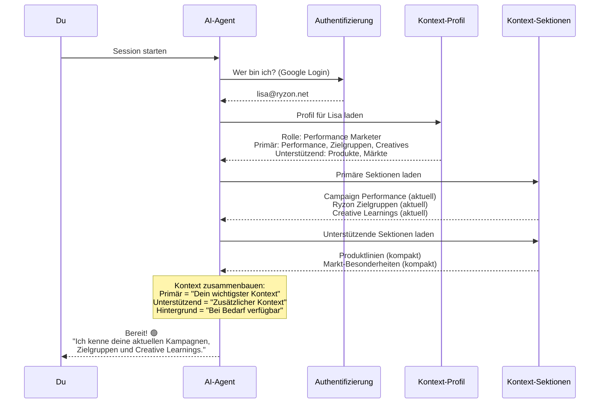
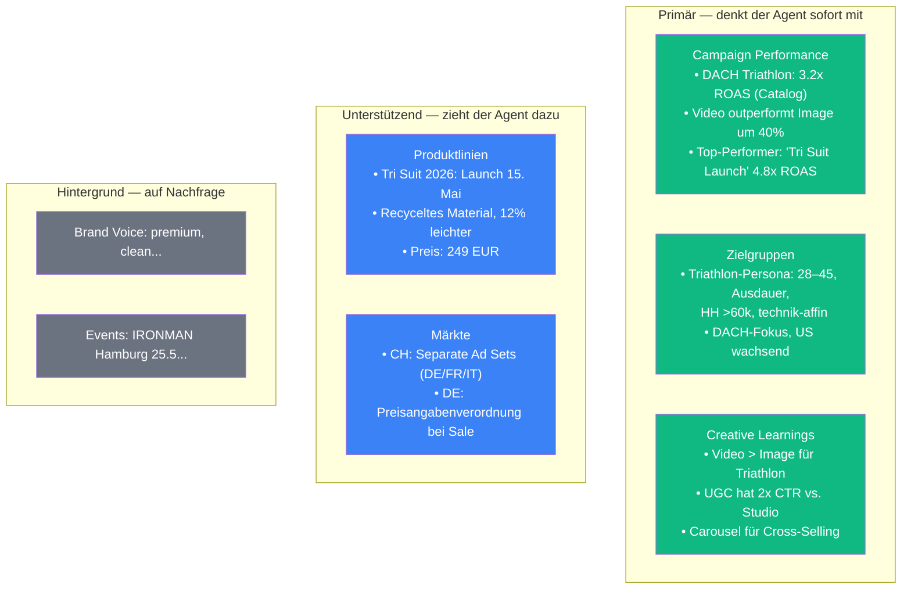
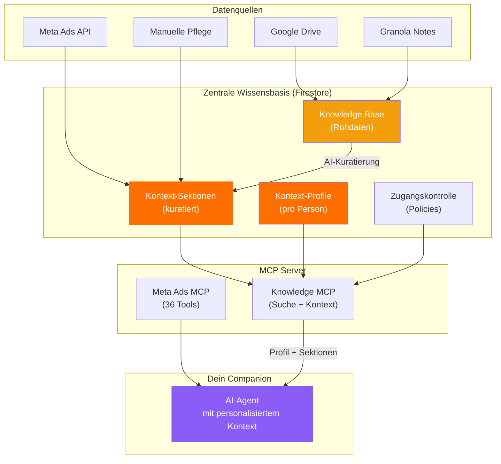

# Dein Companion in Aktion

> Vom Session-Start bis zur smarten Antwort — wie der personalisierte Agent im Alltag funktioniert.

---

## Was passiert, wenn du eine Session startest?

**Das passiert in Sekunden, automatisch, bei jedem Session-Start.** Kein Copy-Paste, kein Briefing. Du startest und der Agent weiß Bescheid.

---

## Konkretes Szenario: Triathlon-Kampagne DACH

### Die Aufgabe

> **Du:** Erstelle eine neue Conversion-Kampagne für die Triathlon-Linie im DACH-Markt.

### Was der Agent bereits weiß (nach Profil-Stufe)

### Die Antwort des Agents

> **Agent:** Basierend auf euren aktuellen Daten empfehle ich:
>
> **Kampagnenstruktur:**
> - Catalog-Kampagne (3.2x ROAS historisch im Triathlon-Segment)
> - Separate Ad Sets für DE, AT und CH (CH mit DE/FR-Varianten)
>
> **Zielgruppe:**
> - Triathlon-Persona: 28–45, Ausdauersportler, HH >60k
> - Lookalike basierend auf Top 5% Käufern der Triathlon-Linie
>
> **Creative-Empfehlung:**
> - Video als Lead-Format (40% besser als Image in diesem Segment)
> - UGC-Style bevorzugt (2x CTR)
> - Tri Suit 2026 als Hero-Produkt (Launch 15. Mai — Timing passt perfekt)
>
> **Budget-Orientierung:**
> - Basierend auf dem aktuellen Spend-Trend (+15% MoM) und einem Target-ROAS von 3x
>
> Soll ich die Kampagne so im Meta Ads Manager anlegen?

**Ohne ein einziges Wort Kontext von dir.** Alles kam aus den Sektionen, priorisiert nach deinem Profil.

---

## Was das im Alltag bedeutet

| Heute | Mit Context Companion |
|-------|----------------------|
| "Moment, ich kopiere dir die Zielgruppen rein..." | Agent kennt die Zielgruppen bereits |
| "Schau mal in den Ads Manager, was gerade performt" | Agent hat aktuelle Performance-Daten |
| "Der Ton sollte eher so wie..." | Agent kennt die Brand Voice |
| "Vergiss nicht, für CH brauchen wir..." | Agent weiß über Markt-Besonderheiten Bescheid |
| "Nächsten Monat launcht übrigens..." | Agent kennt den Launch-Kalender |

---

## Wo der Context Companion in der Architektur lebt

**Kontext-Sektionen und Profile** sind eine neue Schicht in der bestehenden Firestore-Infrastruktur. Sie bauen auf der Knowledge Base auf und werden über den gleichen MCP-Server ausgeliefert — kein neues System, sondern eine Erweiterung.

---

## Diskussion

**Fragen an euch:**
- Welche täglichen Aufgaben würden am meisten von persistentem Kontext profitieren?
- Gibt es Situationen, in denen ihr euer Profil temporär anpassen wollen würdet? (z.B. während eines Produkt-Launches die Produktlinien-Sektion auf "Primär" setzen)
- Sollte der Agent euch am Anfang sagen, welchen Kontext er geladen hat — oder soll das unsichtbar im Hintergrund passieren?
