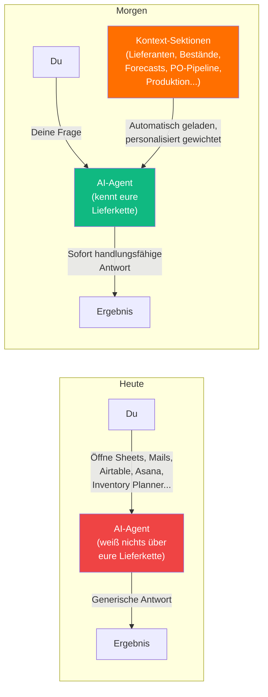

# Jeder Agent startet bei Null — SCM Edition

> Warum AI-Assistenten heute nichts über eure Lieferkette wissen — und was sich ändert, wenn sie eure Lieferanten, Prozesse und Bestände kennen.

---

## Heute: Kontext verstreut über 9+ Systeme

Stellt euch folgendes Szenario vor:

> **Du:** Ich muss die PO für die neue Tri Suit Kollektion bei Petratex aufsetzen. Was brauche ich?
>
> **AI-Agent:** Gerne! Wie heißt der Lieferant? Welche Produkte? Welche Mengen? Welche Preise? Welche Incoterms? Welche Lieferadresse? Welches Format hat eure PO?

Der Agent weiß nichts. Nicht über Petratex, nicht über eure BOMs, nicht über die letzte Preisverhandlung, nicht über den aktuellen Bestand, nicht über den Forecast.

Was macht ihr dann? Ihr öffnet:
- Das **Google Sheet "fortlaufende Order"** für die Bestellübersicht
- Das **PO-Template** in Excel
- **Inventory Planner** für den Bedarfsforecast
- Das **Airtable PIM** für Produktdaten und SKUs
- Das **Looker Studio Board** für Varianten-Performance
- **E-Mails** mit der letzten Preisbestätigung von Petratex
- **Asana** für den PD→SCM Übergabestatus

**Das ist die Kontext-Steuer** — die Zeit, die ihr jeden Tag damit verbringt, Informationen aus fragmentierten Systemen zusammenzusuchen und dem AI-Agenten beizubringen, wie eure Lieferkette funktioniert.

---

## Morgen: Der Agent kennt eure Lieferkette

Das gleiche Szenario, aber der Agent kennt Ryzon SCM:

> **Du:** Ich muss die PO für die neue Tri Suit Kollektion bei Petratex aufsetzen.
>
> **AI-Agent:** Basierend auf euren aktuellen Daten:
>
> - **Petratex** (Tier 1, FOB): Letzte PO war #2026-034 im Februar, Lieferperformance 94%. Kontakt: Maria Santos. ERP: Petrabook.
> - **Mengen:** Laut aktuellem Forecast braucht ihr 3.200 Stück Tri Suit (60% M/L, basierend auf Q1-Sellthrough). Tri Short: 1.800 Stück.
> - **Materialien:** Die Stoffe von Carvico (Tier 2) sind bereits bestellt — Lieferzusage KW 22. Reißverschlüsse von YKK bestätigt.
> - **Preise:** Letzte Verhandlung: 38,50 EUR/Stück (FOB), 3% unter Vorjahr.
> - **Timeline:** Bei PO-Versand diese Woche ist Wareneingang bei Active Ants in KW 28 realistisch — rechtzeitig vor dem Launch am 15. Mai? Nein, das ist zu knapp. Soll ich prüfen, ob Luftfracht eine Option ist?
>
> Soll ich die PO vorbereiten?

---

## Was sich ändert

---

## Die drei Veränderungen

| | Heute | Morgen |
|---|---|---|
| **Kontext** | Verstreut über 9+ Systeme, manuell zusammengesucht | Konsolidiert und automatisch geladen |
| **Relevanz** | Du musst dem Agent erklären, wie eure SC funktioniert | Agent kennt FOB/CMT, Tier-Struktur, Lieferanten |
| **Aktualität** | Kontext ist so aktuell wie dein letzter Blick ins Sheet | Sektionen aktualisieren sich aus Live-Daten |

---

## Diskussion

**Frage an euch:** Welche Informationen sucht ihr am häufigsten zusammen, bevor ihr eine Entscheidung treffen könnt? Wo geht die meiste Zeit verloren — bei der Datenbeschaffung oder bei der Analyse?
