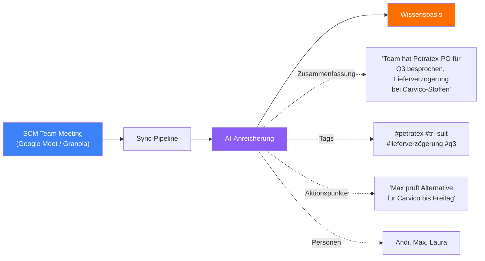
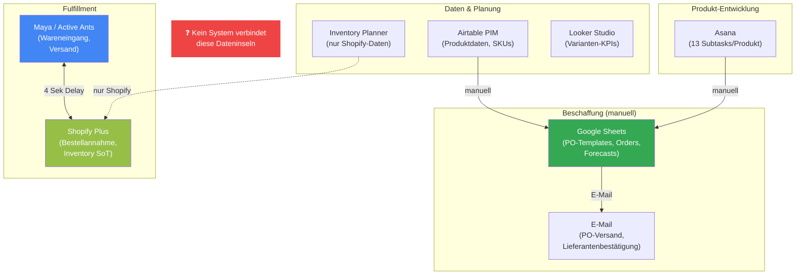

# Das Fundament steht bereits

> Die zentrale Wissensbasis und AI-Infrastruktur sind live — jetzt erweitern wir sie für Supply Chain.

---

## Was heute schon funktioniert

Die Ryzon AI-Plattform hat bereits ein funktionierendes Fundament:

| Fähigkeit | Status | Was das bedeutet |
|-----------|--------|-----------------|
| **Zentrale Wissensbasis** (Firestore) | Live | Meeting-Notizen, Entscheidungen und Dokumente sind durchsuchbar |
| **AI-Anreicherung** (Zusammenfassungen, Tags) | Live | Jedes Dokument wird automatisch strukturiert |
| **Semantische Suche** (Voyage AI) | Live | Natürlichsprachliche Fragen an die Wissensbasis |
| **Zugangskontrolle** (rollenbasiert) | Live | Vertrauliche Informationen nur für berechtigte Rollen |
| **MCP-Server** (Meta Ads, Knowledge) | Live | AI-Agenten können auf die Wissensbasis zugreifen |

> Für eine detaillierte Übersicht: siehe [Ryzon AI Platform — Project Overview](../PROJECT_SHOWCASE.md)

---

## Was die Wissensbasis heute schon aus SCM-Meetings extrahiert

Wenn euer Team-Meeting automatisch in die Wissensbasis fließt, passiert Folgendes:

Das bedeutet: Entscheidungen, die ihr in Meetings trefft, sind bereits durchsuchbar. Aber **operative Daten** — Bestellungen, Bestände, Lieferantenstatus, Forecasts — sind es noch nicht.

---

## Eure Systemlandschaft heute

**9 Systeme, keine Verbindung.** Jede Information muss manuell von einem System ins nächste übertragen werden.

---

## Die Lücke: Operatives SCM-Wissen

Der AI-Agent kennt heute eure **Meeting-Entscheidungen** (über die Wissensbasis), aber nicht:

| Fehlendes Wissen | Wo es heute lebt | Problem |
|------------------|-------------------|---------|
| Lieferanten-Status & Performance | E-Mails, PO-Sheets | Kein zentraler Überblick |
| Aktuelle PO-Pipeline | Google Sheet "fortlaufende Order" | Manuell, nicht mit SKUs verknüpft |
| Bestandslevel & Reichweiten | Shopify + Inventory Planner | Fragmentiert, keine Komponentensicht |
| Forecast & Bedarfsplanung | Manuell aus 4+ Quellen | Kein automatischer Bestellvorschlag |
| Produktionsfortschritt | E-Mails, reaktiv | Kein Monitoring bis zur Nachfrage |
| BOM & Materialabhängigkeiten | Nicht zentral verknüpft | Komponentenbedarf nicht ableitbar |
| Preise & Verhandlungsergebnisse | PO-Sheets, E-Mail-Anhänge | Nicht durchsuchbar |

**Das operative SCM-Wissen lebt in Google Sheets, E-Mails und in euren Köpfen.** Kontext-Sektionen machen es für den AI-Agenten verfügbar — kuratiert, strukturiert und immer aktuell.

---

## ERP als zukünftige Datenquelle

Das ERP (Odoo Pilot geplant) wird mittelfristig viele dieser Datenquellen konsolidieren. Aber:
- **Das ERP ist noch nicht live** — die Kontext-Sektionen arbeiten mit den heutigen Quellen
- **Wenn das ERP kommt**, werden die Sektionen einfach die Quelle wechseln (von Sheets/Mails auf ERP-Daten)
- **Das System ist quellenunabhängig** — es kuratiert Wissen, egal woher es kommt

---

## Überleitung

Die Infrastruktur für AI-gestützte Wissensbereitstellung ist da. Was fehlt, ist eine Schicht, die euer **operatives SCM-Wissen kuratiert und personalisiert** an den Agent liefert.

Das sind **Kontext-Sektionen** — das nächste Kapitel.
