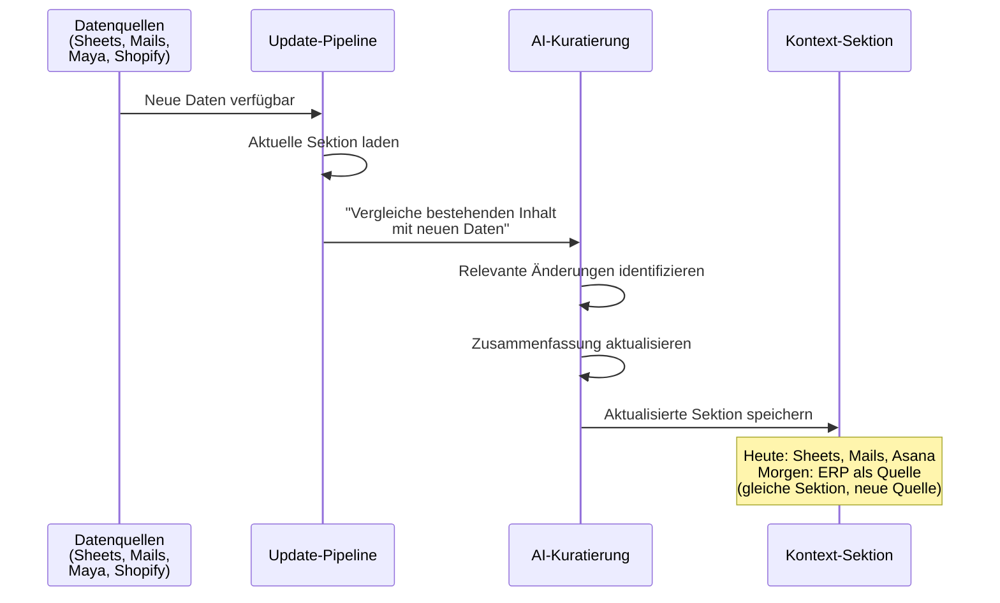

# Kontext-Sektionen — Modulare Wissensbausteine für SCM

> Kuratiertes, aktuelles Supply-Chain-Wissen in unabhängigen Bausteinen — aus 9+ Systemen konsolidiert in strukturierte Briefings.

---

## Was ist eine Kontext-Sektion?

Eine Kontext-Sektion ist ein **kuratierter Wissensblock** zu einem bestimmten Thema. Keine Kopie eures Google Sheets — sondern ein AI-aufbereitetes Briefing, das die relevanten Informationen aus verschiedenen Quellen zusammenführt.

Stellt euch jede Sektion wie ein lebendiges Briefing vor:
- **Automatisch aktualisiert**, wenn neue Daten verfügbar sind
- **Konsolidiert** aus mehreren Quellen (Sheets, Mails, Wissensbasis)
- **Unabhängig** von anderen Sektionen — einzeln pfleg- und aktualisierbar

---

## Anatomie einer Sektion

| Eigenschaft | Beschreibung | Beispiel |
|-------------|-------------|---------|
| **Name** | Eindeutiger Bezeichner | "Lieferanten-Übersicht" |
| **Inhalt** | AI-kuratierte Zusammenfassung (Markdown) | "Petratex (T1, FOB): 94% Lieferperformance..." |
| **Quelle(n)** | Woher die Daten kommen | PO-Sheets + E-Mail-Korrespondenz + Meetings |
| **Aktualisierung** | Wie oft der Inhalt erneuert wird | Wöchentlich |
| **Format** | Wie der Inhalt gespeichert ist | Markdown-Text in Firestore |

---

## Kandidaten für SCM-Sektionen

### 1. Lieferanten-Übersicht
Status, Performance und Kontaktdaten aller aktiven Tier-1- und Tier-2-Lieferanten. Lead Times, Kapazitäten, bekannte Risiken.

| | |
|---|---|
| **Quelle** | PO-Sheets + E-Mail-Korrespondenz + Meetings |
| **Aktualisierung** | Wöchentlich |
| **Beispiel-Inhalt** | "**Petratex** (T1, FOB): 15 aktive Styles, Lieferperformance 94%, avg Lead Time 8 Wochen. Kontakt: Maria Santos. ERP: Petrabook. **Carvico** (T2, Stoffe): Hauptlieferant für Tri-Stoffe, aktuell 2 Wochen Verzögerung bei Jersey 280g..." |

### 2. PO-Pipeline & Bestellstatus
Aktive Purchase Orders mit Status, erwarteten Lieferterminen, offenen Mengen und Abweichungen vom Plan.

| | |
|---|---|
| **Quelle** | Google Sheet "fortlaufende Order" + Lieferantenbestätigungen |
| **Aktualisierung** | Täglich bis wöchentlich |
| **Beispiel-Inhalt** | "**Offene POs:** 12 aktiv, Gesamtwert 485k EUR. **Kritisch:** PO-2026-041 (LTP, Cycling Bib) — 3 Wochen hinter Plan, Stoff von Carvico verspätet. **On Track:** PO-2026-038 (Petratex, Tri Suit) — Produktion gestartet, ETA KW 28..." |

### 3. Bestandslevel & Reichweiten
Aktuelle Bestände pro Produktlinie, Reichweiten basierend auf Sell-Through-Raten, kritische Out-of-Stock-Risiken.

| | |
|---|---|
| **Quelle** | Shopify Inventory + Inventory Planner + Active Ants (Maya) |
| **Aktualisierung** | Täglich |
| **Beispiel-Inhalt** | "**Running:** 12.400 Einheiten, Reichweite 6,2 Wochen. **Kritisch:** Running Tight Damen M — nur noch 45 Stück, Reichweite 4 Tage, Replenishment PO erst in KW 24. **Triathlon:** 8.200 Einheiten, ausreichend bis Launch neue Kollektion..." |

### 4. Forecast & Demand Planning
Aktuelle Bedarfsprognosen, saisonale Trends, Abweichungen Plan vs. Ist, Growth Projections.

| | |
|---|---|
| **Quelle** | Inventory Planner + Shopify Analytics + Looker Studio |
| **Aktualisierung** | Wöchentlich |
| **Beispiel-Inhalt** | "**Q3 Forecast:** Triathlon +22% vs. Q3 Vorjahr (IRONMAN-Saison). Running stabil (+5%). Cycling -8% (saisonale Normalisierung). **Promo-Risiko:** Summer Sale ab 15.7. — erwartet 35% Uplift für 2 Wochen, aktueller Bestand reicht für Running, kritisch bei Tri Accessories..." |

### 5. Produktion & Materialstatus
Laufende Produktionen bei Konfektionären, Materialverfügbarkeit bei Tier-2-Lieferanten, Qualitätsstatus.

| | |
|---|---|
| **Quelle** | E-Mail-Korrespondenz + PO-Sheets + Meeting-Notizen |
| **Aktualisierung** | Wöchentlich |
| **Beispiel-Inhalt** | "**In Produktion:** 4 laufende Aufträge. Petratex: Tri Suit 2026 (3.200 Stk, 60% fertig, on schedule). LTP: Cycling Jersey (1.500 Stk, Stoff verspätet — neuer Start KW 23). **Material-Alerts:** Nilorn Packaging: Forecast für Q3 muss bis Freitag bestätigt werden (Joost/Max)..." |

### 6. Fulfillment & Logistik
Active Ants Status, Inbound-Pipeline, Versandperformance, geplanter US-3PL-Status.

| | |
|---|---|
| **Quelle** | Maya (Active Ants) + Shopify + GoKarla |
| **Aktualisierung** | Täglich |
| **Beispiel-Inhalt** | "**Inbound:** 2 Lieferungen diese Woche erwartet — PO-2026-035 (Running, 2.400 Einheiten Di), PO-2026-037 (Accessories, 800 Einheiten Do). **Outbound:** Ø 1.100 Orders/Tag (Normalphase). Versandperformance: 98.2% Same-Day. **US-3PL:** Evaluation läuft, kein Go-Live-Termin..." |

### 7. Preise & Konditionen
Aktuelle Einkaufspreise pro Lieferant und Produktkategorie, Preishistorie, Verhandlungsergebnisse, Incoterms.

| | |
|---|---|
| **Quelle** | PO-Sheets + E-Mail-Korrespondenz + Margin List |
| **Aktualisierung** | Bei Änderungen (nach Verhandlungen) |
| **Beispiel-Inhalt** | "**Petratex FOB-Preise:** Tri Suit 38,50 EUR (-3% vs. Vorjahr), Cycling Bib 28,20 EUR (unverändert). **Carvico Stoffpreise:** Jersey 280g 12,80 EUR/m (+5% Rohstoffkosten). **Incoterms:** Petratex FOB Lisbon, Stamperia EXW Biella..." |

### 8. PD→SCM Übergabe-Status
Aktuelle Übergaben aus der Produktentwicklung, offene Subtasks pro Produkt, Rollenbelegung in den Phasen 6–10.

| | |
|---|---|
| **Quelle** | Asana (13 Subtasks/Produkt) + Meeting-Notizen |
| **Aktualisierung** | Wöchentlich |
| **Beispiel-Inhalt** | "**Neue Übergaben:** 3 Styles diese Woche — Signature Drop 'Midnight' (2 Jacken, 1 Hoodie). Phase 6 gestartet: Forecast T1 (Andi), Fabric Order (Max). **Blockiert:** Running Tight v3 — Tech Pack noch nicht final (PD, ETA Freitag)..." |

### 9. Compliance & Transparenz
Retraced-Status, aktuelle Compliance-Anforderungen, Lieferanten-Audits, Nachhaltigkeitskennzahlen.

| | |
|---|---|
| **Quelle** | Retraced + manuelle Pflege |
| **Aktualisierung** | Monatlich |
| **Beispiel-Inhalt** | "**Retraced-Coverage:** 85% der Tier-1-Lieferanten vollständig dokumentiert. **Offen:** LTP — Audit ausstehend seit KW 14. **Neues Requirement:** EU-Lieferkettengesetz — Due Diligence Report bis Q4 erforderlich..." |

---

## Wie Sektionen aktuell bleiben

**Wichtig:** Wenn das ERP live geht, wechseln die Sektionen einfach ihre Datenquelle — der Inhalt und die Struktur bleiben gleich. Das System ist quellenunabhängig.

---

## Diskussion

**Fragen an euch:**
- Welche dieser Sektionen wären für eure tägliche Arbeit am wertvollsten?
- Welche Sektionen fehlen in der Liste?
- Gibt es Informationen, die ihr heute besonders mühsam zusammensuchen müsst?
- Welche Datenquellen haben wir übersehen?
