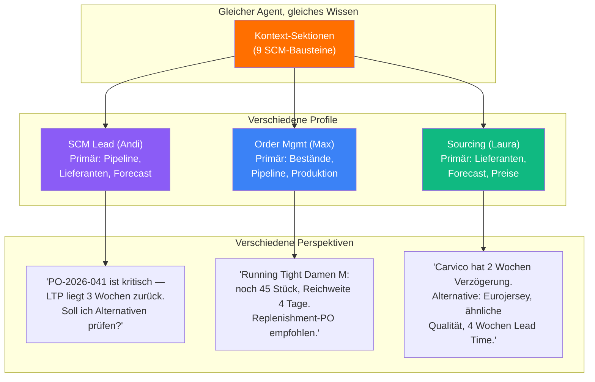

# Kontext-Profile — Deine persönliche Linse

> Gleicher Agent, gleiches Wissen — aber Andi denkt in Mengenplanung, Max in SKU-Details und Laura in Lieferantenrisiken.

---

## Was ist ein Kontext-Profil?

Ein Profil legt fest, **welche Sektionen** der Agent lädt und **wie prominent** er sie gewichtet. Die Agent-Anweisungen sind für alle gleich — nur die Gewichtung unterscheidet sich.

Ein SCM Lead und ein Supply Chain Administrator bekommen den **gleichen intelligenten Assistenten** — aber der Assistent priorisiert, was für die jeweilige Rolle am wichtigsten ist.

---

## Wie Gewichtung funktioniert

LLMs gewichten Informationen automatisch danach, **wie sie präsentiert werden**. Wenn ihr einem Kollegen sagt "Achte vor allem auf die Liefertermine", fokussiert sich das Gespräch darauf. Beim AI-Agenten funktioniert das genauso.

Drei Stufen:

| Stufe | Bedeutung | Wie der Agent damit umgeht |
|-------|-----------|---------------------------|
| **Primär** | Kernwissen für deine tägliche Arbeit | Agent bezieht sich proaktiv darauf, nutzt es als Basis |
| **Unterstützend** | Nützlicher Hintergrund | Agent nutzt es, wenn relevant |
| **Hintergrund** | Verfügbar bei Bedarf | Agent bringt es nur auf Nachfrage ein |

**Keine Technik, sondern Framing:** "Dein wichtigster Kontext ist die PO-Pipeline" bewirkt, dass der Agent bei jeder Frage automatisch den Bestellstatus mitdenkt.

---

## Beispiel-Profile

### SCM Lead (Andi)

> *Steuert das Gesamtbild: Mengenplanung, Lieferantenbeziehungen, Preisverhandlungen. Braucht den Überblick über Pipeline, Lieferanten und Forecasts.*

| Sektion | Stufe |
|---------|-------|
| PO-Pipeline & Bestellstatus | **Primär** |
| Lieferanten-Übersicht | **Primär** |
| Forecast & Demand Planning | **Primär** |
| Preise & Konditionen | Unterstützend |
| Produktion & Materialstatus | Unterstützend |
| Bestandslevel & Reichweiten | Unterstützend |
| PD→SCM Übergabe-Status | Hintergrund |
| Fulfillment & Logistik | Hintergrund |
| Compliance & Transparenz | Hintergrund |

**Typische Frage:** "Welche POs sind kritisch für den Tri Suit Launch?"
**Agent antwortet mit:** PO-Status, Lieferantenperformance und Forecast-Abgleich — proaktiv, ohne Nachfrage.

---

### Order & SKU Management (Max)

> *Arbeitet auf SKU-Ebene: Mengenplanung pro Variante, Ordersheet-Erstellung, Replenishment, Fabric Orders. Braucht granulare Bestands- und Bestelldaten.*

| Sektion | Stufe |
|---------|-------|
| Bestandslevel & Reichweiten | **Primär** |
| PO-Pipeline & Bestellstatus | **Primär** |
| Produktion & Materialstatus | **Primär** |
| PD→SCM Übergabe-Status | Unterstützend |
| Forecast & Demand Planning | Unterstützend |
| Fulfillment & Logistik | Unterstützend |
| Lieferanten-Übersicht | Hintergrund |
| Preise & Konditionen | Hintergrund |
| Compliance & Transparenz | Hintergrund |

**Typische Frage:** "Welche Running-SKUs müssen nachbestellt werden?"
**Agent antwortet mit:** Bestandsreichweiten pro Variante, offene POs die bereits unterwegs sind, und Nachbestellempfehlungen basierend auf Sell-Through-Raten.

---

### Sourcing & Risk Management (Laura)

> *Verantwortlich für Lieferantenauswahl, Risikobewertung und Demand Planning. Braucht den strategischen Blick auf Lieferantenbasis und Beschaffungsrisiken.*

| Sektion | Stufe |
|---------|-------|
| Lieferanten-Übersicht | **Primär** |
| Forecast & Demand Planning | **Primär** |
| Preise & Konditionen | **Primär** |
| Compliance & Transparenz | Unterstützend |
| Produktion & Materialstatus | Unterstützend |
| PO-Pipeline & Bestellstatus | Unterstützend |
| Bestandslevel & Reichweiten | Hintergrund |
| PD→SCM Übergabe-Status | Hintergrund |
| Fulfillment & Logistik | Hintergrund |

**Typische Frage:** "Welche Lieferanten haben aktuell Lieferverzögerungen?"
**Agent antwortet mit:** Performance-Übersicht aller Lieferanten, aktuelle Verzögerungen mit Root Cause, alternative Lieferanten und Risikoeinschätzung.

---

## Visualisierung

**Gleicher Agent. Gleiches Lieferketten-Wissen. Drei verschiedene Denkweisen** — je nachdem, was für die jeweilige Rolle am wichtigsten ist.

---

## Diskussion

**Fragen an euch:**
- Welches Profil kommt eurer Rolle am nächsten?
- Was würdet ihr ändern — welche Sektionen höher oder niedriger gewichten?
- Gibt es Situationen, in denen ihr temporär ein anderes Profil bräuchtet? (z.B. während einer Order-Phase)
- Sollten Amelie, Daria, Christo und andere im Team eigene Profile bekommen?
