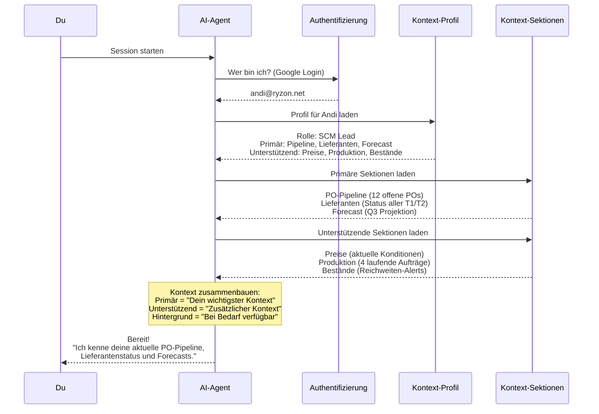
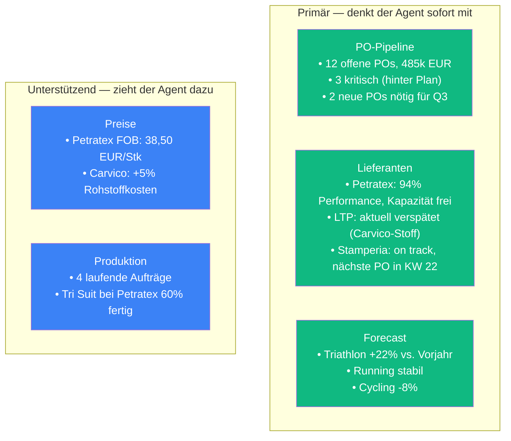
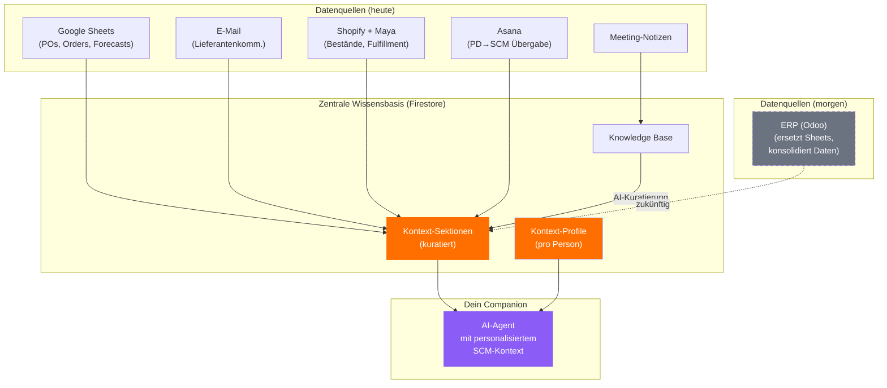

# Dein Companion in Aktion

> Vom Session-Start bis zur handlungsfähigen Antwort — wie der personalisierte SCM-Agent im Alltag funktioniert.

---

## Was passiert, wenn du eine Session startest?

**Sekunden, automatisch, bei jedem Session-Start.** Kein Sheet öffnen, kein E-Mail durchsuchen.

---

## Szenario 1: PO-Vorbereitung

### Die Aufgabe

> **Du (Andi):** Ich muss die POs für die Q3-Kollektion vorbereiten. Gib mir einen Überblick.

### Was der Agent weiß (nach Profil-Stufe)

### Die Antwort des Agents

> **Agent:** Hier ist der Q3-Überblick für die PO-Planung:
>
> **Neue POs erforderlich (2):**
> 1. **Tri Suit 2026 Restock** — Petratex, ~1.600 Stück (basierend auf +22% Forecast vs. Vorjahr). Petratex hat Kapazität und aktuelle Performance von 94%. FOB-Preis: 38,50 EUR. Bei PO diese Woche: ETA KW 30.
> 2. **Running Tight Replenishment** — Damen M ist kritisch (45 Stück, 4 Tage Reichweite). Empfehle 1.200 Stück bei Stamperia. On track, nächster freier Slot KW 23.
>
> **Achtung:**
> - LTP Cycling Bib (PO-2026-041) liegt 3 Wochen zurück — Carvico-Stoff verspätet. Soll ich Alternativen prüfen?
> - Carvico-Stoffpreise sind +5% — betrifft alle Aufträge mit Jersey 280g
>
> **Nächste Schritte:**
> - [ ] PO-Mengen für Tri Suit Restock bestätigen
> - [ ] LTP-Verzögerung eskalieren oder Alternative evaluieren
> - [ ] Nilorn Packaging Forecast Q3 bestätigen (Joost/Max, Deadline Freitag)
>
> Soll ich die PO für Petratex vorbereiten?

**Ohne ein einziges Sheet zu öffnen.** Der Agent kennt die Pipeline, die Lieferanten, den Forecast und die Preise.

---

## Szenario 2: Bestandsalarm (Max)

> **Max:** Welche SKUs sind kritisch?
>
> **Agent:** Drei SKUs mit Reichweite unter 7 Tagen:
>
> | SKU | Bestand | Reichweite | Status Replenishment |
> |-----|---------|------------|---------------------|
> | Running Tight Damen M (schwarz) | 45 Stk | 4 Tage | Keine offene PO — **Aktion nötig** |
> | Tri Short Herren L (navy) | 120 Stk | 6 Tage | PO-2026-039 unterwegs, ETA KW 22 |
> | Cycling Jersey Herren S (weiß) | 30 Stk | 5 Tage | Produktion bei LTP verspätet |
>
> Für die Running Tight empfehle ich eine Sofort-PO: 1.200 Stück bei Stamperia, basierend auf den letzten 4 Wochen Sell-Through (Ø 11 Stk/Tag für diese Variante). Soll ich das Ordersheet vorbereiten?

---

## Szenario 3: Lieferanten-Risiko (Laura)

> **Laura:** Wie sieht unsere Abhängigkeit von Carvico aus?
>
> **Agent:** Carvico ist euer Hauptlieferant für Performance-Stoffe:
>
> - **Betroffene Produktlinien:** Triathlon (100% Jersey 280g), Cycling Bib (80% Jersey 220g)
> - **Aktive POs mit Carvico-Material:** 4 Stück, Gesamtwert Materialanteil ~62k EUR
> - **Aktuelles Risiko:** 2 Wochen Verzögerung bei Jersey 280g, betrifft LTP-Produktion (PO-2026-041)
> - **Preisdruck:** +5% Rohstoffkosten YoY
>
> **Diversifizierung:** Eurojersey (Italien) bietet vergleichbare Qualität mit 4 Wochen Lead Time. Bisher kein aktives Lieferantenverhältnis. Soll ich eine Vergleichstabelle für die nächste Sourcing-Bewertung vorbereiten?

---

## Was das im Alltag bedeutet

| Heute | Mit Context Companion |
|-------|----------------------|
| "Moment, ich schau im Sheet nach..." | Agent kennt alle offenen POs |
| "Wie war nochmal der Preis bei Petratex?" | Agent kennt aktuelle Konditionen |
| "Welche SKUs müssen wir nachbestellen?" | Agent hat Bestandsreichweiten parat |
| "Wer ist für den Fabric Order zuständig?" | Agent kennt die Rollenmatrix |
| "Wie ist der Stand bei LTP?" | Agent kennt den Produktionsstatus |
| "Haben wir genug für Black Friday?" | Agent rechnet Forecast gegen Bestand |

---

## Wo der Context Companion in der Architektur lebt

**Kontext-Sektionen sind quellenunabhängig.** Heute kommen die Daten aus Sheets und Mails. Wenn das ERP live geht, wechselt die Quelle — die Sektionen und Profile bleiben gleich.

---

## Diskussion

**Fragen an euch:**
- Welche der drei Szenarien spricht euch am meisten an?
- Welche täglichen Aufgaben würden am meisten von persistentem Kontext profitieren?
- In welchen Phasen des Bestellzyklus (Pre-Order, Order, Produktion, Inbound) wäre der Companion am wertvollsten?
- Sollte der Agent euch proaktiv warnen, wenn Reichweiten kritisch werden oder POs hinter Plan liegen?
