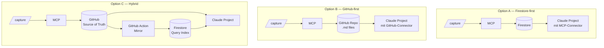

# Knowledge Setup — Status & Design Brief

*Stand: 2026-04-20, abends · vor Follow-up mit Sophie & Luca morgen 11:30*

> Konsolidiert den aktuellen Stand nach der Discovery-Session. Markiert was **entschieden**, was **Arbeitsrichtung** und was **noch offen** ist. Dient als Navigation für die Follow-up-Besprechung und alle Folge-Diskussionen.

**Legende**
- ✅ Entschieden
- 🎯 Arbeitsrichtung (zur Bestätigung)
- ❓ Offen / zu besprechen
- 📌 Parkplatz / später

---

## 1. Was wir gehört haben — Discovery Output

### User-Profil
Sophie & Luca sind **Ops / Commercial**, nicht Brand / Creative. Das verändert das gesamte Solution-Framing im Vergleich zum ursprünglichen Context-Companion-Konzept.

### Top-10 Kontext-Items (beide "Täglich" gevotet)
1. Eigene Claude-Chats
2. Meetingnotizen (Granola / Google Docs)
3. Was Kolleg:innen diese Woche gelernt haben
4. Laufende Projekte & Status
5. Events & Saisonkalender
6. Campaign Performance (ROAS)
7. **Historische Entscheidungen & deren Begründung** ← ankert Decision Log
8. CRM
9. Sales / Fin KPIs
10. Kunden-Verständnis (historisches Learning)

### Abgelehnt
- **Creative Learnings** — beide rot
- **Brand Voice** — Sophie rot, Luca neutral
- **Ryzon Zielgruppen · Produktlinien · Wettbewerb** — alle neutral

### Pain Map

**Lost Knowledge** — wo entsteht Wissen, das verloren geht?
`Claude Chats · Meeting Notes · GDS Analysen · Excel Analysen · Slack Chats · Marios Bierdeckel · unstrukturierter Kontext`

**Aktuelles Claude Setup** — warum vertraue ich der Antwort nicht?
`Determenistisches LLM ↔ Halluzination ↔ Falsche Antworten ↔ schlecht reproduzierbar · Gewichtung von Kontext · Connection across domains · Collaboration`

### Wichtigste Insights
1. **Ops-Profil, nicht Brand** — Decision-, KPI- und Process-Knowledge zentral
2. **"Marios Bierdeckel"** — eigener Problemtyp: Tribal Knowledge aus informellen Gesprächen mit Key-Personen
3. **Lucas Kernthema ist Vertrauen, nicht Speicherung** — Black-Box-Retrieval ist gegen das Grundbedürfnis
4. **Entscheidungen sind die wertvollste Entität** — "Historische Entscheidungen & Begründung" war Top-Voting-Item

---

## 2. Design-Prinzipien (aus Discovery)

1. **Transparenz > Komfort** — Luca priorisiert Nachvollziehbarkeit über Schnelligkeit
2. **Source-of-Truth muss sichtbar sein** — Marios Adoption hängt davon ab, dass er seinen Beitrag findet
3. **Decisions sind First-Class** — nicht "noch eine Note", eigener Typ mit Schema und Gewichtung
4. **Claude Project ist das zentrale Interface** — damit Mario & externer Berater nicht ausgeschlossen sind
5. **Erst die Habit, dann die Weighting** — Lucas Gewichtungs-Wunsch löst sich, wenn strukturierte Daten da sind

---

## 3. Architektur — drei Lösungs-Optionen



### Entscheidungsmatrix

| Kriterium | A — Firestore | B — GitHub | C — Hybrid |
|---|---|---|---|
| Transparenz | ⚠️ opak | ✅ voll | ✅ voll |
| Query-Power | ✅ stark | ⚠️ schwach | ✅ stark |
| Kollaboration | ⚠️ eigene UI nötig | ✅ via PR | ✅ via PR |
| Adoption Mario | ⚠️ unsichtbar | ✅ Files sichtbar | ✅ Files sichtbar |
| Build-Aufwand MVP | niedrig | niedrig | mittel |
| Luca-Buy-in | ⚠️ | ✅ | ✅ |
| Skalierung >500 Einträge | ✅ | ⚠️ | ✅ |
| Bestehende Infra (knowledge-mcp) | ✅ direkt | ⚠️ teil-Umbau | ✅ direkt nutzbar |

### 🎯 Arbeitsrichtung
- **Start (Woche 1–6):** **Option B — GitHub-first**
- **Evolution (Woche 6+):** zu **Option C — Hybrid**, wenn Volumen oder Query-Bedarf es rechtfertigt
- **Option A (Firestore-only):** nicht weiterverfolgen — Transparenz-Defizit wiegt schwerer als Infra-Vorteil

### ❓ Offen
- Bestätigung der Richtung durch Sophie / Luca morgen
- Repo-Struktur: 1 zentrales Repo oder 1 Repo pro Domain (sales, product, ...)?
- Private Ryzon-GitHub-Org vs existierende Org?

---

## 4. Distribution: Plugin via Claude App Directory

### ✅ Entschieden
- Plugin als Distribution-Layer
- Upload via **Claude App → Customize → Directory → Plugins → Upload plugin**
- Alternative zusätzlich: eigene Org-Marketplace auf **privatem** GitHub hosten

### ❓ MVP-Commands (zu bestätigen)

| Command | Zweck | Priorität |
|---|---|---|
| `/capture <type> <content>` | Strukturiertes Entry erstellen (note \| learning \| analysis) | MVP |
| `/decision <question>` | Decision Log Entry — strukturiert mit Schema | MVP |
| `/pull <domain>` | Kontext-Pack für Domain laden | MVP |
| `/sources` | Quellen der letzten Antwort listen (Fallback zu F4) | MVP |
| `/consistency` | Frage 3× parallel stellen, Deltas zeigen | Woche 3+ |
| `/pack <name>` | Context Pack aktivieren (wenn Stufe 2 erreicht) | Woche 5+ |

---

## 5. Interface: Claude Project

### ✅ Entschieden
- Zentrales User-Interface ist das **Claude Project**
- Begründung: Mario (Geschäftsführer) und externer Berater ohne Tech-Setup
- Plugin stellt Commands bereit · Project Instructions steuern Verhalten

### ❓ Offen
- **Project Instructions Template** — wer schreibt die erste Version?
- **Access Control:** was sehen externer Berater und Mario? Decision Logs können vertraulich sein
- **GitHub-Sync-Modell:** manueller Pull über GitHub-Connector akzeptiert (Mario braucht GH-Account oder lebt mit verzögertem Sync via Kollege:in)

---

## 6. Trust-Features — zwei Pakete

### Paket "Transparenz" (Woche 1)

**F4 — Context Audit**
Jede Antwort endet mit Quellen-Liste. In Project Instructions verankert:
> *"Bei jeder Antwort: liste am Ende unter 'Quellen:' die verwendeten Files. Wenn ein File die Antwort maßgeblich geprägt hat, nenne warum (1 Zeile)."*
Kosten: 5 Zeilen. Wirkung: sofort sichtbares Vertrauen.

**F2 — Trust-Badges**
Frontmatter-Metadaten pro Eintrag: `source`, `verified_at`, `confidence` (verified | draft | raw). Claude kann auf "nur verified" eingeschränkt werden.

### Paket "Reproduzierbarkeit" (Woche 3+)

**F1 — Decision Log als First-Class Entity** (siehe §7)
**F3 — Consistency Check** via `/consistency` — 3× parallel mit gleichem Kontext, Deltas sichtbar

### 🎯 Arbeitsrichtung
- **F4 + F2 ab Tag 1** — beide günstig, beide Vertrauen-stiftend
- **F1 (Decision Log) ebenfalls Woche 1** — weil "Historische Entscheidungen" Top-Voting-Item war
- **F3 Woche 3+**

---

## 7. Retrieval-Strategie

### 🎯 Aktuelle Neigung (Simon)
**Stufe 1 (jetzt):** Instructions-basierte Source-Transparenz + Tag-basierter Filter + Decision Log als gewichtete Entität
**Stufe 2 (mittelfristig):** Context Packs für wiederkehrende Workflows
**Stufe 3 (Zukunft):** Graph-based Retrieval

### Decision Log — First-Class Entity

Eigenständiger Typ im KB, nicht "noch eine Markdown-Datei mit #decision Tag".

```yaml
---
type: decision
id: dec-2026-04-15-crm-tool
title: "CRM-Tool-Wahl: HubSpot vs Pipedrive"
decided_at: 2026-04-15
decided_by: [simon, mario]
context_used:
  - sales-kpi-q1
  - team-feedback-crm
question: "Welches CRM setzen wir ab Q2 ein?"
decision: "HubSpot"
rationale: |
  Entscheidungsgründe...
weight: high           # explizite Gewichtung: business-kritisch
tags: [crm, tooling, q2-planning]
entities: [hubspot, pipedrive]
supersedes: dec-2025-11-02-crm-eval
---

# Decision body...
```

**Warum extra Gewichtung (`weight: high`)?**
- Decisions sind Referenz-Punkte für zukünftige Fragen
- Claude soll wiederkehrende Fragen **per Default zuerst gegen die Decision Log matchen**
- `weight: high` = wird immer in Retrieval-Scope gezogen, unabhängig vom Tag-Filter

### Tag-basierter Filter (Woche 1)

Pflicht-Frontmatter für jede `.md`:

| Feld | Typ | Beispiel |
|---|---|---|
| `type` | enum | `note` \| `decision` \| `meeting` \| `learning` \| `analysis` |
| `domain` | enum | `sales` \| `marketing` \| `product` \| `ops` \| `customer` |
| `entities` | array | `[apollo, q2-campaign]` |
| `date` | ISO-Date | `2026-04-20` |
| `author` | string | `sophie` |
| `weight` | enum | `low` \| `normal` \| `high` (nur bei Decisions default `high`) |

### Source-Transparenz (Woche 1)

In Project Instructions fest verankert:
> *"Bei jeder Antwort: liste am Ende unter 'Quellen:' die verwendeten Files. Wenn ein File die Antwort maßgeblich geprägt hat, nenne warum (1 Zeile)."*

### Stufe 2 — Context Packs (Woche 5+)

Wenn 5 wiederkehrende Workflow-Patterns identifiziert → feste Bundles. Beispiele:
- `sales-meeting-prep` → CRM-State + letzte Decisions + relevante Kunden-Notes
- `campaign-review` → Performance-Daten + letzte Learnings + Budget-Context
- `customer-deep-dive` → alle Notes + Decisions + Tickets zu einem Kunden

Plugin-Command: `/pack sales-meeting-prep`

### Stufe 3 — Graph Retrieval (Vision Q3+)

- Entitäten (Decisions, Kunden, Campaigns, Projekte, Personen) als **Knoten**
- Relationen: *"Decision X betrifft Kunde Y in Projekt Z"*, *"Decision X supersedes Decision W"*
- Query-Beispiel: *"Alle Decisions zu Kunde Apollo der letzten 6 Monate + deren Begründung + was die Daten zum Zeitpunkt sagten"*
- **Voraussetzung:** Schema-Design, ggf. Neo4j oder Firestore-Graph-Erweiterung
- **Wichtig:** Das heutige Frontmatter-Schema oben ist **bereits graph-kompatibel** (`entities`, `supersedes`, `context_used`) — kein Rebuild später nötig

### ❓ Noch zu besprechen (nächste Session)
- **Semantic Search** — absichtlich weggelassen oder als Ergänzung in Stufe 2?
- **Retrieval-Evaluation** — wie messen wir, ob Retrieval gut wird? Definition von Erfolg?
- **Tag-Governance** — freies Tagging vs. kontrollierte Taxonomie? Wer darf neue Tags einführen?
- **Decision-Owner** — wer hat Schreibrechte auf Decision Log? (Mario protected? Review-Flow?)

---

## 8. Bis morgen 11:30 — To-Dos

### Simon (heute Abend)
- [ ] Claude App GitHub-Connector Sync-Verhalten testen und dokumentieren
- [ ] 1-Seiten-Synthese für Sophie & Luca schreiben
- [ ] Demo-ready Plugin-Skelett bauen (upload-fähig, mit `/capture` + `/sources` als erste Commands)
- [ ] 2-Wochen-Experiment-Plan finalisieren

### Diskussion morgen
- [ ] Bestätigung Option B (GitHub-first) als Startpunkt
- [ ] Erste 5 Commands im MVP festlegen
- [ ] Decision-Log-Schema gemeinsam schärfen
- [ ] Access-Control für Mario / externer Berater
- [ ] Retrieval-Evaluation: wie definieren wir Erfolg nach 2 Wochen?

---

## 9. Parking Lot 📌

- **"Marios Bierdeckel"** — eigener Epic, dedizierte Session mit Mario zu planen
- **Semantic Search** — ob und wann einführen, wenn Tag-Filter an Grenzen stößt
- **Graph Retrieval** — Vision Q3+, Schema schon heute kompatibel halten
- **Ryzon Cockpit** — mittelfristige Ziel-Architektur (Custom UI mit managed Context Packs)
- **Hallway-Knowledge-Capture** — generalisierte Lösung für informelle Gespräche

---

## Glossar

| Begriff | Bedeutung |
|---|---|
| **KB** | Knowledge Base |
| **MCP** | Model Context Protocol (Anthropic) |
| **Context Pack** | Kuratierte Sammlung von Kontext-Items für einen wiederkehrenden Workflow |
| **Decision Log** | Strukturierter Speicher für Business-Entscheidungen mit Begründung, Schema-basiert |
| **Trust-Badge** | Metadatum, das Zuverlässigkeit eines KB-Eintrags anzeigt (verified · draft · raw) |
| **Frontmatter** | YAML-Metadaten-Block am Anfang einer `.md`-Datei |
| **First-Class Entity** | Entity-Typ mit eigenem Schema und privilegierter Behandlung im System |
