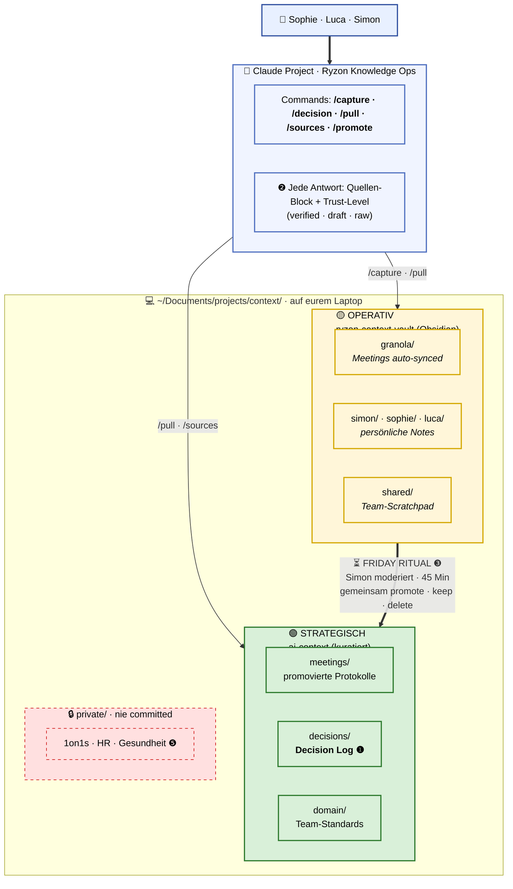
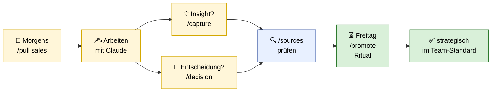
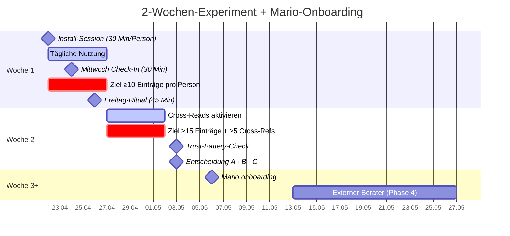

# Knowledge Setup — Meeting Sophie & Luca

*30 Min · Diagramm-basiert · 5 Diskussions-Punkte*

---

## Das ganze Setup auf einen Blick

---

## Was ihr tut — täglich & wöchentlich

---

## Diskussions-Punkte · was wir heute von euch brauchen

| | Frage | Kontext |
|---|---|---|
| **❶** | **Decision-Log-Schema — passen die Felder?** | `question · decision · rationale · context_used · decided_by · supersedes` · fehlt etwas · ist eines überflüssig? |
| **❷** | **Transparenz-Block — wie viel Detail?** | Claude listet bei jeder Antwort die Quellen · soll das sichtbar bleiben oder nur bei Bedarf (`/sources`)? |
| **❸** | **Promotion-Flow — wer entscheidet was strategisch wird?** | Freitag-Ritual: jede:r selbst · Peer-Check · Simon als Gatekeeper? |
| **❹** | **Tag-Taxonomie — frei oder kontrolliert?** | Feste Tag-Liste mit Retro-Änderungen · oder freies Tagging mit Agent-Normalisierung? |
| **❺** | **Mario ab Woche 3 — was darf er sehen?** | alles team-shared · oder bestimmte Kategorien (HR, Personalentscheidungen) weiterhin geschützt? |

---

## Timeline

---

## Was wir heute NICHT lösen

`Marios Bierdeckel` · `Semantic Search` · `KI-Auto-Tagging` · `Ryzon Cockpit` · `Externer Berater`

→ alles in Parking Lot, kommt zurück, wenn Fundament steht.
