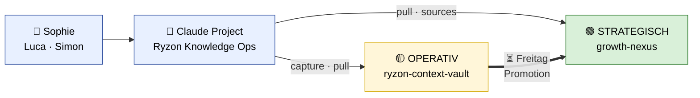
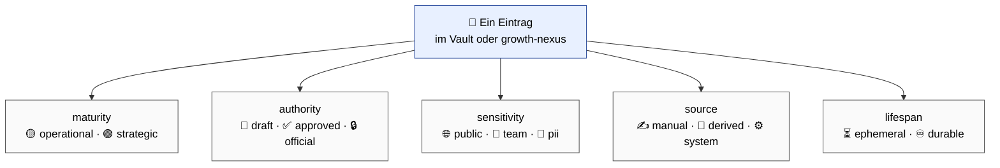
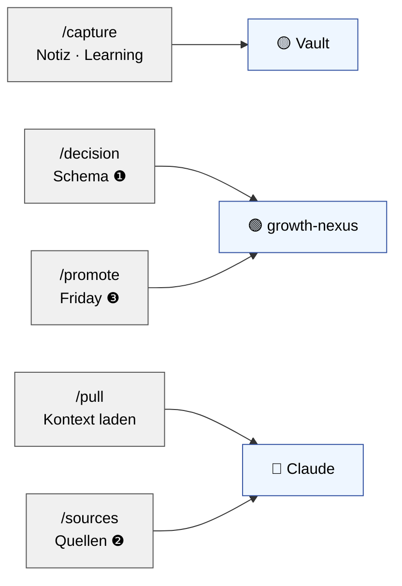
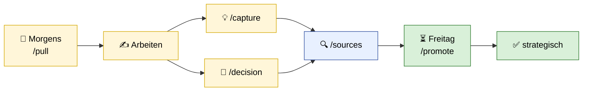

# Knowledge Setup — Meeting Sophie & Luca

*30 Min · Diagramm-basiert · 5 Diskussions-Punkte*

---

## Die zwei Welten



**Lokal auf eurem Laptop** unter `~/Documents/projects/context/`:

```
ryzon-context-vault/           🟡 OPERATIV (individuelle Obsidian-Vaults)
├── simon/ sophie/ luca/       persönliche Notes + Meetings
│   └── meetings/              Meeting-Notes (Granola, Google Meet, manuell)
└── shared/                    Team-Scratchpad

growth-nexus/                    🟢 STRATEGISCH (kuratiert, Team-Standard)
├── meetings/                  promovierte Protokolle
├── decisions/                 Decision Log ❶
├── domain/                    Team-Standards
└── private/                   🔒 nie committed · 1on1s · HR · Gesundheit ❺
```

---

## Die 5 Dimensionen pro Eintrag · der zentrale Baustein

Jeder Wissens-Eintrag trägt **5 Dimensionen** im Frontmatter. Sie steuern, wie Claude damit arbeitet und wer Zugriff hat.



| Dimension | Bedeutung | Wirkt auf |
|---|---|---|
| **maturity** | Reifegrad — wo im Flow steht es | Claude priorisiert `strategic` bei Team-Standard-Fragen |
| **authority** | Wie verbindlich ist es | `draft` darf Claude nutzen, muss aber kennzeichnen. `official` ist gesetzt |
| **sensitivity** | Wer darf lesen | `pii` landet automatisch in `private/` · `team` bleibt für euch vier |
| **source** | Woher kommt es | transparent: kam es vom Mensch oder Agent oder System |
| **lifespan** | Wie lange relevant | `ephemeral` wird nach ~90 Tagen archiviert · `durable` bleibt |

### Beispiel — Apollo-Learning das Sophie gerade captured

```yaml
---
title: Apollo Video-Content performt 2x besser
type: learning
domain: marketing
author: sophie
# ─── Die 5 Dimensionen ─────────────────────
maturity: operational     # 🟡 noch nicht strategisch
authority: draft          # 📝 nicht verified
sensitivity: team         # 👥 ihr dürft alle lesen
source: manual            # ✍️ kam aus /capture
lifespan: ephemeral       # ⏳ 90-Tage-Halbwertszeit
# ───────────────────────────────────────────
entities: [apollo, video-content]
tags: [performance, creative]
---
```

**→ Nach Friday-Ritual vielleicht:** `maturity: strategic · authority: approved · lifespan: durable`

### Defaults pro Eintrags-Typ (setzt ein Agent automatisch)

| Type | maturity | authority | sensitivity | source | lifespan |
|---|---|---|---|---|---|
| note | operational | draft | team | manual | ephemeral |
| learning | operational | draft | team | manual | ephemeral |
| meeting | operational | draft | team | manual | ephemeral |
| analysis | strategic | draft | team | derived | durable |
| **decision** | **strategic** | **approved** | **team** | **manual** | **durable** |

Ihr müsst die Felder nie selbst tippen — `/capture` und `/decision` setzen die Defaults. Ihr könnt sie aber jederzeit überschreiben.

---

## Die Commands



---

## Täglicher + wöchentlicher Flow



---

## Diskussions-Punkte · was wir heute von euch brauchen

| | Frage | Kontext |
|---|---|---|
| **❶** | **Decision-Log-Schema — passen die Felder?** | `question · decision · rationale · context_used · decided_by · supersedes` · fehlt etwas · ist eines überflüssig? |
| **❷** | **Transparenz-Block — wie viel Detail?** | Claude listet bei jeder Antwort die Quellen · soll das sichtbar bleiben oder nur bei Bedarf (`/sources`)? |
| **❸** | **Promotion-Flow — wer entscheidet was strategisch wird?** | Freitag-Ritual: jede:r selbst · Peer-Check · Simon als Gatekeeper? |
| **❹** | **Tag-Taxonomie — frei oder kontrolliert?** | Feste Tag-Liste mit Retro-Änderungen · oder freies Tagging mit Agent-Normalisierung? |
| **❺** | **Mario ab Woche 3 — was darf er sehen?** | alles team-shared · oder bestimmte Kategorien (HR, Personalentscheidungen) weiterhin geschützt via `sensitivity: pii`? |

---

## Timeline · Empfehlung: Start Di 28.04

| | Datum | Was |
|---|---|---|
| **Pre-Rollout** | Mi–Fr 22.–24.04 | Simon: Bug-Fix · Repos · Plugin · Install-Script |
| **Install-Session** | Mo 27.04 | 30 Min Screen-Share pro Person |
| **Woche 1 Start** | Di 28.04 | Daily `/pull` + `/capture` · Ziel ≥10 Einträge/Person |
| **Check-In** | Mi 30.04 | 30 Min Mid-Week |
| **Woche 2** | 01.–07.05 | Cross-Reads · ≥15 Einträge · ≥5 Cross-Refs |
| **1. Friday-Retro** | Fr 08.05 | 45 Min · Trust-Battery · Entscheidung A/B/C |
| **Mario dazu** | ab Woche 3 (12.05) | Install + Onboarding |

*Hinweis: 01.05 ist Feiertag — darum 1. Retro erst am 08.05*

---

## Was wir heute NICHT lösen

`Marios Bierdeckel` · `Semantic Search` · `KI-Auto-Tagging` · `Ryzon Cockpit` · `Externer Berater`

→ alles in Parking Lot, kommt zurück, wenn Fundament steht.
